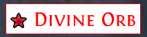

# 프로토타입 Doc

# 1. 프로젝트 개요

- 목표  / 핵심 문제 / 해결 방안
    
    ### 1.1 목표
    
    - **매 시즌 반복되는 PoE 필터 제작 노동을 자동화**
    - 필터블레이드 / poe2filter / poe.ninja를 “보완 + 연결”하는 실사용 도구 제작
    - 장기적으로는 **게임 유틸 중심 포털 사이트**로 확장
    
    ### 1.2 핵심 문제
    
    - BaseType 중복
    - 티어별 아이템 관리의 반복 작업
    - 사운드 설정 관련 사용자 문의 과다
    - 시즌마다 필터 전체를 다시 손봐야 하는 구조
    
    ### 1.3 해결 방향
    
    - DB 기반 아이템/티어 관리
    - RID 기반 필터 규칙 구조
    - 시각적 UI + 자동 필터 코드 생성
    - 사운드/난이도/플랫폼(PC/PS5) 분리 설계

# 2. 사이트 전체 구조 (페이지 단위)

- 메인 구조와 PoE2 섹션 (초기 집중 영역)
    
    ### 2.1 메인 구조
    
    - 게임 포털 형태
    - 게임별로 페이지 분리 (PoE2, PoE1, WoW 등)
    
    ### 2.2 PoE2 섹션 (초기 집중 영역)
    
    - 아이템 페이지 (DB 뷰)
    - 아이템 필터 페이지 (편집/생성)
    - 사운드 설정 페이지
    - 필터 다운로드 / 프리뷰

# 3. 아이템 / DB 설계

- Class - BaseType 중심
- 엄격함을 기준으로 하는 필터의 종류
    
    ### ⭐ Starter
    
    - 새로운 리그 시작 / 신규 유저
    - 가장 많은 아이템 표시
    - 미감정 아이템도 표시 가능 (T1/T2/그외)
    - `ItemLevel >= min(베이스별 min_ilvl)` 또는 79
    
    ### ⭐ Strict
    
    - 필터 대상 : 엔드게임 진입한 플레이어를 위한 필터
    - 경로석 기준 : T1 - T14  플레이어 추천
    - 베이스 아이템 : T1~T2 + T3 희귀 등급만
    - 장비 : 1-2 티어만
    - 미감정 등급 : 3~5
    - `ItemLevel >= 79` + 베이스별 min_ilvl 반영
    
    ### ⭐ VesryStrict
    
    - 경로석 15T 이상 플레이시 추천
    - 가치에 따라 일부 화폐는 D 티어 이하 숨김
    - 장비 : T1-T2 만 표시
    - 미감정 등급 : 4~5
    - `ItemLevel >= 79` + 베이스별 min_ilvl 반영
    
    ### ⭐ Uber (Vaal)
    
    - 고자본 종결 빌드를 위한 필터
    - 화폐 : S ~ C
    - 장비 : T1 만 표시
    - 미감정 등급 : 5
    - 1-2 티어 화폐와 장비만 표시
    - 1-2 티어 관련 사운드를 제외한 대부분 사운드 제거
        - 화폐 c 티어 사운드 삭제
        - 장비 t2 , t3 사운드 삭제
        - 플라스크, 경로석 사운드 삭제
    - 바알 사원런처럼 빠르고 강한 엔드 빌드를 위한 필터
    - `ItemLevel >= 82` + 베이스별 min_ilvl 반영
    
    ### ⭐ Uber (Vaal)
    
    - 화폐 : S ~ B
    - 장비 : T1 만
    - 미감정 등급 : 5
    - `ItemLevel >= 82` + 베이스별 min_ilvl 반영
    
    ### ⭐ PS5-VeryStrict
    
    - 플스 유저 전용
    - VeryStrict 버전에서 커스텀 사운드를 기본 인게임 사운드로 변경한 버전
    
    ### ⭐ PS5-Uber
    
    - 플스 유저 전용
    - Uber 버전에서 커스텀 사운드를 기본 인게임 사운드로 변경한 버전
- 화폐 프리셋 (Currency Presets)
- 베이스 아이템(gear) 티어와 미감정 등급을 시각적으로 구분하는 요소
    - ✅ 테두리 (SetBorderColor)
        - T1: Pink
        - T2: Yellow
        - 그 외: 없음
    - ✅ 빛기둥(PlayEffect)
        - Unid 5: Red
        - Unid 4: Yellow
        - Unid <=3: 없음
- 필터를 위한 사이트
    - [https://poe2filter.com/tier-list/gear](https://poe2filter.com/tier-list/gear) 를 UI/UX를 개선하고 한글화 사이트로 만든다
    - 프리셋
        - 사이트 첫 페이지에서 필터 프리셋을 선택할 수있어야 한다
        - 만약 Uber를 선택하면 최소 아이템 레벨의 값은 79가 아닌 82가  된다.
        - 유저는 커스텀 페이지에서 다른 레벨을(79~82)을 선택하거나 직접 입력이 가능하다
        - 관리자 페이지에서 이 기본값은 변경할 수 있다
- 클래스  리스트
    - 무기 클래스 (Weapon Classes)
        - 창 (Spears)
        - 부적 (Talismans)
        - 육척봉 (Quarterstaves)
        - 셉터 (Sceptres)
        - 마법봉 (Wands)
        - 지팡이 (Staves)
        - 활 (Bows)
        - 화살통 (Quivers)
        - 석궁 (Crossvows)
        - 한손 철퇴 (One Hand Maces)
        - 양손 철퇴 (Two Hand Maces)
    - 방어구 클래스 (Armour Classes)
        - 헬멧 (Helmets)
        - 갑옷 (Body Armours)
        - 장갑 (Gloves)
        - 장화 (Boots)
        - 방패 (Shields)
        - 집중구 (Foci)
        - 버클러 (Bucklers)
    - 방어구 타입 (Armour Types)
        - 방어도 (AR - Armour)
        - 방어도 / 에너지 보호막 (AR - Armour / ES - Energy Shield)
        - 에너지 보호막 (ES - Energy Shield)
        - 에너지 보호막 / 회피 (ES - Energy Shield / EV - Evasion)
        - 회피 / 방어도 (EV - Evasion / AR - Armour)
        - 회피 (EV - Evasion Rating)
    - 장신구
        - 목걸이 (Amulets)
        - 반지 (Rings)
        - 균열 반지 (Breach Ring*)*
        - 벨트 (Belts)
    - 화폐 (Currency)
    - 룬 (Socketables)
    - 액체 감정 (Emotions - 환영 Delirium)
    - 촉매제 (Catalysts / 균열 Breach)
    - 징조 (Omen / 의식 Ritual)
    - 탐험 일지 (Expedition Logbooks)
    - 유물 (Relics)
    - 에센스 (Essences)
    - 유니크 (Uniques)
    - 경로석 (Waystones)
    - 새겨진 결전 (Inscribed Ultimatum)
    - 찬스 아이템 (Chance -기회의 오브를 아이템에 사용하면 값비싼 아이템으로 바뀔 수 있는 아이템)
    - 스킬 젬 (Gems)
    - 혈통 젬 (Lineage Gems)
    - 골드 (Gold)
    - 주얼 (Jewels*)*
    - 플라스크 (Flasks)
    - 호신부 (Charms)
    - 석판 (Tablets)
    - Special
        - 조각 (Fragments)
        - 보스 조각 (Pinnacle Keys)
        - 황혼 유물 보관실 키 (Twilight Reliquary Key*)*
- 섹션 주석 규칙
    - 섹션은 각 클래스 및 카테고리를 나누는 사이트의 제목에 해당한다
    - 섹션 내용은 주석은 | 로 분리하고 왼쪽은 한글, 오른쪽은 영문으로 작성
    
    ```jsx
    #==================================================
    # [SECTION: tablet]
    # 서판 | Tablet
    #==================================================
    ```
    
- Show/Hide 주석 규칙
    - 첫 줄은 코드에 대한 주석. | 넣어도 위에 섹션과 문제되지 않음
    - RID : 코드 내부에서 인식하기 위한 필수 입력 사항
    - SRC
        
        ```jsx
        # 서판 1 티어 | 의식 서판
        # [RID: tablet_t1]
        # [SRC: fb] $type->fragments->generic $tier->b !fragments_b
        # [SRC: p2f] A-Tier Tablet (currency)
        ```
        
        - 참고한 필터의 코드가 어디에 있는지를 알 수 있도록 주석을 그대로 붙여넣는다
        - fb : 네버싱크의 FilterBlade 사이트에서 다운받은 필터
        - p2f : [Poe2filter.com](http://Poe2filter.com) 사이트에서 다운받은 필터
        - SRC는 사이트 구현 후 필요없는 임시 규칙
- 화폐 티어별 코드
    - 화폐 티어를 나누는 기준은 신성한 오브(Divine Orb)와 엑잘티드 오브(Exalted Orb) 시세 기준
    - 실시간 시세를 매일 1회 또는 1시간에 한번 불러와서 갱신한다
        - S 티어 : ≥ 1.0 Div
        - A 티어 : ≥ 30 Ex and < 1.0 Div
        - B 티어 : ≥ 10 Ex and < 30 Ex
        - C 티어 : ≥ 1.0 Ex 표시 (실제로는 ≥ 0.8 Ex and < 1.0 Ex)
        - D 티어 : < 0.8 Ex
    - S 티어
        
        
        
        ```jsx
        Show
        Class == "Incubators" "Stackable Currency"
        BaseType == [[ 10 entries ]]
        SetFontSize 45
        SetTextColor 255 0 0 255
        SetBorderColor 255 0 0 255
        SetBackgroundColor 255 255 255 255
        PlayEffect Red
        MinimapIcon 0 Red Star
        CustomAlertSound "custom_sound/1_currency_s.mp3" 300
        ```
        
    - A 티어
        
        
        
        ```jsx
        Show
        Class == "Incubators" "Stackable Currency"
        BaseType == [[ 11 entries ]]
        SetFontSize 45
        SetTextColor 255 255 255 255
        SetBorderColor 255 255 255 255
        SetBackgroundColor 240 35 120 255
        PlayEffect Orange
        MinimapIcon 0 Orange Circle
        CustomAlertSound "custom_sound/2_currency_a.mp3" 300
        ```
        
    - B 티어
        
        
        
        ```jsx
        Show
        Class == "Incubators" "Stackable Currency"
        BaseType == "Chaos Orb" "Greater Exalted Orb" "Orb of Extraction"
        SetFontSize 45
        SetTextColor 255 255 255 255
        SetBorderColor 255 255 255 255
        SetBackgroundColor 240 90 35 255
        PlayEffect Yellow
        MinimapIcon 1 Yellow Circ
        CustomAlertSound "custom_sound/3_currency_b.mp3" 300
        ```
        
    - C 티어
        
        
        
        ```jsx
        Show
        Class == "Incubators" "Stackable Currency"
        
        SetFontSize 42
        SetTextColor 0 0 0 255
        SetBorderColor 0 0 0 255
        SetBackgroundColor 249 150 25 255
        MinimapIcon 1 Yellow Circl
        CustomAlertSound "custom_sound/4_currency_c.mp3" 300
        ```
        
    - D 티어
        
        
        
        ```jsx
        Show
        Class == "Incubators" "Stackable Currency"
        BaseType == [[ 10 entries ]]
        SetFontSize 42
        SetBackgroundColor 210 178 135 255
        SetTextColor 0 0 0 255
        SetBorderColor 0 0 0 255
        ```
        
    - F 티어 (화폐 전용)
        
        
        
        ```jsx
        Show
        Class == "Incubators" "Stackable Currency"
        BaseType == [[ 6 entries ]]
        SetFontSize 38
        SetTextColor 220 175 132
        SetBorderColor 220 175 132
        ```
        
    - 주문 감정서
        
        
        
        ```jsx
        Show
        Class == "Incubators" "Stackable Currency"
        BaseType == "Scroll of Wisdom"
        SetFontSize 42
        SetTextColor 255 255 255 255
        SetBorderColor 255 255 255 255
        SetBackgroundColor 120 51 57 255
        ```
        
- 기타 아이템 코드
    - 탐험 일지 레벨 77+
        
        
        
        ```jsx
        Show
        ItemLevel >= 77
        Class == "Expedition Logbooks"
        SetFontSize 45
        SetTextColor 255 255 255 255
        SetBorderColor 255 255 255 255
        SetBackgroundColor 0 180 166 255
        PlayEffect Red
        MinimapIcon 0 Red Hexagon
        CustomAlertSound "1maybevaluable.mp3" 300
        ```
        
    - 탐험 일지
        
        
        
        ```jsx
        Show
        Class == "Expedition Logbooks"
        SetFontSize 45
        SetTextColor 255 255 255 255
        SetBorderColor 210 178 135 255
        SetBackgroundColor 36 104 123 255
        PlayEffect Red
        MinimapIcon 0 Red Hexagon
        CustomAlertSound "4maps.mp3" 300
        ```
        
    - 탐험 유물
        
        
        
        ```jsx
        Show
        Class == 
        BaseType == 
        SetFontSize 42
        SetTextColor 255 255 255 255
        SetBorderColor 255 255 255 255
        SetBackgroundColor 90 0 127 255
        ```
        
    - 서판
        - 희귀 등급
            
            
            
            ```jsx
            # 서판 희귀 등급
            # [RID: tablet_rare]
            Show
              Class == "Tablet"
              Rarity Rare
              SetFontSize 42
              SetTextColor 255 255 255 255
              SetBorderColor 255 255 255 255
              SetBackgroundColor 103 117 130 255
              PlayAlertSound 2 300
              PlayEffect Yellow
              MinimapIcon 1 Yellow Square
              PlayAlertSound 1 300
            ```
            
- 장비 티어별 공통 코드 예시
    - T1 : 1 티어 82레벨 이상
        
        ```jsx
        	ItemLevel >= 82
        	SetFontSize 45
        	SetBorderColor 255 0 130 # Pink
        	PlayEffect Pink
        	MinimapIcon 0 Pink Diamond
        ```
        
    - T2 : 2 티어 79 레벨 이상
        
        ```jsx
        	ItemLevel >= 79
        	SetFontSize 42
        	SetBorderColor 255 234 0 #Yellow
        ```
        
    - T3 : 3 티어 79 레벨 이상
        
        ```jsx
        	ItemLevel >= 79
        	SetFontSize 38
        ```
        
    - T4 (분류 없음)
        
        ```jsx
        	SetFontSize 35
        ```
        
- 중복 처리 규칙
    - 동일 BaseType이 여러 티어에 등장 시
        - **가장 높은 티어 우선**
        - 하위 티어에서는 자동 제거

# 4. RID 기반 필터 규칙 구조 (핵심 설계)

- RID 목적 / 규칙 / 기본 구조
    
    ### 4.1 RID 목적
    
    - 필터 규칙을 **사이트와 코드에서 동일하게 식별**
    - Sync / Diff / 자동 병합의 기준 키
    
    ### 4.2 RID 네이밍 규칙
    
    - 소문자 + 숫자 + `_` 만 사용
    - 짧고 의미 중심
    - 특수문자(`+`) 사용 ❌
    
    ### 4.3 필터 파일 내 표기 방식
    
    - 필터 파일 내 표기 방식
        - 첫 번째 주석: **사이트용 메인 제목**
        - 두 번째 주석: RID 네이밍
        - Show / Hide는 규칙에 따라 섞여 있음
            
            ```jsx
            # 무기 - 창 | 1 티어 리스트
            # [RID: gear_weapons_spears_t1]
            Show 
            	Rarity Rare
            	SetFontSize 40
            	SetBorderColor 255 0 130 # Pink
            
            # 무기 - 창 | 2 티어 리스트
            # [RID: gear_weapons_spears_t2]
            	Rarity Rare
            	SetFontSize 35
            	SetBorderColor 255 234 0 #Yellow
            ```
            
    
    ### 4.4 RID 기본 구조 (가장 중요)
    
    - 뒤로 갈수록 **선택(optional)**
    - 항상 **왼쪽부터 점점 구체화**
        
        ```
        [domain]_[category]_[subtype?]_[tier/condition?]
        ```
        
- 도메인 최상위 분류
    
    
    | Domain | 의미 | Domain | 의미 |
    | --- | --- | --- | --- |
    | `currency` | 화폐 | `uniques` | 유니크 |
    | `weapon` | 무기 | `armour` | 방어구 |
    | `accessory` | 장신구 | `jewels` | 주얼 |
    | `chance` | 찬스 아이템 | `craft` | 제작/옵셔널 |
    | `omen` | 의식 징조 | `catalysts` | 균열 기폭제 |
    | `expedition`  | 탐험 유물 | `emotions` | 환영 액체 |
    | `essences` | 에센스 | `relics` | 유물 |
    | `gems` | 미가공 젬/혈통 젬 |  |  |
    | `socketable` | 룬/영혼핵 | `idol` | 우상 |
    | `special` | 키/조각/결전 |  |  |
    | `charms` | 호신부 | `flasks` | 플라스크 |
    | `waystones` | 경로석 | `tablets` | 석판 |
    | `misc` | 기타 |  |  |
- 무기 클래스 RID 규칙 | Weapon Classes
    
    ```
    weapon_[class]
    ```
    
    | 클래스 | RID |
    | --- | --- |
    | Spears | `weapon_spears` |
    | Talismans | `weapon_talismans` |
    | Quarterstaves | `weapon_quarterstaves` |
    | Sceptres | `weapon_sceptres` |
    | Wands | `weapon_wands` |
    | Staves | `weapon_staves` |
    | Bows | `weapon_bows` |
    | Quivers | `weapon_quivers` |
    | Crossbows | `weapon_crossbows` |
    | One Hand Maces | `weapon_maces_1h` |
    | Two Hand Maces | `weapon_maces_2h` |
    
    📌 한손/양손은 `_1h`, `_2h`로 통일 (짧고 명확)
    
- 방어구 클래스와 타입 결합 규칙 | Armour Classes +Types
    - 기본 클래스
        
        ```
        armour_[class]
        ```
        
        | 클래스 | RID |
        | --- | --- |
        | Helmets | `armour_helmets` |
        | Body Armours | `armour_body` |
        | Gloves | `armour_gloves` |
        | Boots | `armour_boots` |
        | Shields | `armour_shields` |
        | Foci | `armour_foci` |
        | Bucklers | `armour_bucklers` |
- 방어 타입 접미사 | Armour Types
    
    ```
    armour_[class]_[type]
    ```
    
    | 타입 | RID 접미사 |
    | --- | --- |
    | AR | `ar` |
    | AR / ES | `ar_es` |
    | ES | `es` |
    | ES / EV | `es_ev` |
    | EV / AR | `ev_ar` |
    | EV | `ev` |
    - 예시
        - `armour_gloves_es`
        - `armour_body_ar_es`
        - `armour_helmets_ev`
        
        📌 **타입은 항상 뒤에 붙임**
        
- 장신구 (목걸이/반지/벨트) | Accessory
    
    ```
    accessory_[type]
    ```
    
    | 종류 | RID |
    | --- | --- |
    | Amulets | `accessory_amulets` |
    | Rings | `accessory_rings` |
    | Breach Rings | `accessory_rings_breach` |
    | Belts | `accessory_belts` |
- 티어 / 조건 / 목적에 따른 접미사 (선택)
    - 예시
        
        ```
        _[t1|t2|t3|t4]
        _[craft]
        _[optional]
        _[lvl79]
        _[lvl81]
        ```
        
        - `weapon_sceptres_t1`
        - `armour_gloves_es_t2`
        - `weapon_sceptres_minion_lvl81`
        - `currency_core_s`
        
        📌 **숫자는 항상 의미 있는 값만 사용**
        

## 5. 필터 Sync & Diff 시스템

- 필터 목적/동작 개념/비교
    
    ### 5.1 목적
    
    - 필터블레이드 업데이트를 **자동으로 반영**
    - 수동 복붙으로 생기는 중복/누락 방지
    
    ### 5.2 동작 개념
    
    1. 필터 파일 import
    2. RID 기준으로 기존 DB와 매칭
    3. BaseType 변화 감지
    4. Diff 생성
    
    ### 5.3 Diff UI
    
    - VSCode 스타일
        - 추가: 초록
        - 삭제: 빨강
    - 좌/우 비교 뷰
    - 변경 사항만 선택 적용 가능

## 6. 난이도 프리셋 시스템

- 프리셋 종류/역할/적용 시점
    
    ### 6.1 프리셋 종류 (임시)
    
    - 세부 규칙은 변경될 수 있음
    - Starter : 액트 레벨링 단계에서 사용 (3티어 장비까지 표시)
    - Strict : 엔드게임 초반. T1 ~ T14 경로석 (2티어 장비 + 3티어 장비는 희귀 등급만)
    - VeryStrict : T15 경로석 파밍
    - Uber : T15 경로석 6모드 파밍
    - Uber Strict : 1티어 장비 희귀 등급만 표시
    제작 베이스로 사용되는 아이템인 일반 등급은 작게 표시
    
    ### 6.2 프리셋 역할
    
    - **티어는 동일**
    - Show / Hide / Rarity / ItemLevel 조건만 변경
    
    ### 6.3 적용 시점
    
    - 필터 다운로드 직전
    - 유저가 선택

# 7. 사운드 시스템

- 문제 인식부터 사운드 규칙에 대한 정리
    
    ### 7.1 문제 인식
    
    - 사용자 질문 1순위
    - 전체 제거 / 통일 / 일부 변경 요구가 많음
    
    ### 7.2 사운드 페이지 분리
    
    - 사운드 설정을 **독립 페이지**로 구성
    
    ### 7.3 사운드 구조 (3단)
    
    1. 전역(Global)
    2. 그룹(Group)
    3. 개별 Rule
    
    ### 우선순위
    
    ```
    전역 → 그룹 → 개별
    ```
    
    ### 7.4 주요 기능
    
    - 전역 사운드:
        - 기본 유지
        - 전체 무음
        - 전체 통일
    - 그룹 사운드:
        - 화폐
        - 장비(T1~T4)
        - 제작
        - 지도
    - 개별 룰 예외
    - 사운드 프리셋:
        - 무음
        - 화폐만
        - 제작 강조
        - PS5 기본
    - 미리듣기(PC)
    - 사운드 슬롯 1~10
    
    ### 7.5 PC / PS5 분리
    
    - PC: `CustomAlertSound`
    - PS5: `PlayAlertSound X 300`
    - 플랫폼 토글 제공
    - PS5에서는 커스텀 파일 UI 비활성화
- 사운드 프리셋
    - 사운드 페이지에서 기본값 / PS5 를 선택 할 수 있도록 체크 on/off 로 구현
    - 기본값 :  PC 사운드를 사용
    - PS5 : PS5 값을 사용
- 커스텀 사운드 지원
    - 10 개의 기본 사운드 리스트를 왼쪽에 배치
    - 오른쪽에는 커스텀 사운드 파일을 등록할 수 있도록 UI/UX 구현
    - 를 1:1 매칭으로 다른 사운드 파일로 등록 할 수 있도록 한다
    - 사운드 파일을 업로드하면 사운드를 미리 듣기 할 수 있다
    - 설정값은 브라우저에 로컬 저장한다
    - 추후 로그인 기능을 구현하면 값을 DB에 저장하는 구조로 업그레이드 예정
    - 변경한 커스텀 파일은 최종적으로 필터 코드를 다운로드 할 때 코드에 적용되어야 한다
- 사운드 파일 구조에 대한 설명
    - PC 는 커스텀 파일 사용
    - PS5 유저는 커스텀 파일 사용불가로 다음과 같은 기본 사운드 코드를 적용해야 한다
        - PlayAlertSound 6 300
    - PS5 사운드는 3종류로 사용하지만
    - 사이트에서 PC / PS5 체크 유무에 따라서 커스텀 파일 대신 PS5 코드로 변환
    - PC / PS5 파일은 사이트에 사운드 관련 페이지를 만들고 내부의 관리자용 영역에서 UI로 세팅
    - 사운드 파일
        - 리스트가 비어있을 경우 사운드 사용하지 않음
    
    | 구분 | PC | PS5 |
    | --- | --- | --- |
    | 화폐 S 티어 | CustomAlertSound "custom_sound/1_currency_s.mp3" 300 | PlayAlertSound 5 300 |
    | 화폐 A 티어 | CustomAlertSound "custom_sound/2_currency_a.mp3" 300 | PlayAlertSound 1 300 |
    | 화폐 B 티어 | CustomAlertSound "custom_sound/3_currency_b.mp3" 300 | PlayAlertSound 2 300 |
    | 화폐 C 티어 | CustomAlertSound "custom_sound/4_currency_c.mp3" 300 | PlayAlertSound 2 300 |
    | 화폐 중첩 | CustomAlertSound "custom_sound/10_stack.mp3" 200 |  |
    | 경로석 | CustomAlertSound "custom_sound/9_maps.mp3" 300 |  |
    | 장비 아이템 T1 | CustomAlertSound "custom_sound/5_item_t1.mp3" 300 | PlayAlertSound 1 300 |
    | 장비 아이템 T2 | CustomAlertSound "custom_sound/6_item_t2.mp3" 300 | PlayAlertSound 2 300 |
    | 장비 아이템 T3 | CustomAlertSound "custom_sound/7_item_t3.mp3" 300 |  |
    | 플라스크 | CustomAlertSound "custom_sound/8_flask.mp3" 300 |  |

# 8. 다국어 (한/영) 전략

- 사이트는 한국어를 기본값으로 사용하고 영문을 지원하도록 구현한다
    
    ### 8.1 원칙
    
    - **영문 = 기준**
    - 필터 출력은 항상 영문
    - 사이트 표시만 한/영 선택
    
    ### 8.2 관리 방식 분리
    
    - UI 문구: i18n JSON (`ko.json`, `en.json`)
    - 게임 데이터(BaseType): DB 관리
    
    ### 8.3 레임 번역기 JSON 활용
    
    - 번역 **소스**로 사용
    - 자동 병합 + 관리자 확인 후 확정
    - 직접 전부 타이핑 ❌

# 9. 저장 / 보안 / 자산 보호

- MVP(초기 버전)과 장기적인 로그인 기능 등 계획
    
    ### 9.1 MVP
    
    - 로그인 없음
    - 로컬 저장 (IndexedDB)
    - JSON export / import
    
    ### 9.2 장기
    
    - 로그인 도입
    - 프로젝트 저장
    - 고급 기능 제한
    
    ### 9.3 자산 보호 전략
    
    - 전체 DB dump API 제공 ❌
    - 핵심 로직은 서버에서만 처리
    - Rate limit / 최소 데이터 제공

# 10. MVP 범위 정리

- 초기 버전에 들어가는 리스트와 제외되는 리스트
    
    ### 포함
    
    - PoE2 BaseType DB
    - T1~T4 티어 UI
    - 화폐 티어 UI
    - 사운드 페이지
    - 필터 코드 생성
    - 로컬 저장
    
    ### 제외
    
    - 전체 게임 번역 DB
    - 커뮤니티 게시판
    - 자동 업데이트 데몬
    - 계정 시스템

# 11. 장기 확장 방향

- 장기적으로 다양한 게임 정보/공략/애드온과 매크로 자료를 이용할 수 있는 사이트로 성장
    - PoE1 / WoW / Last Epoch 추가
    - 자동 필터 업데이트
    - 애드온 / 매크로 자료실
    - 프리셋 공유
    - 유료 기능 가능성

# 13. 폰트 크기

- SetFontSize : 폰트 프리셋을 드롭다운 버튼으로 선택 가능하도록 구현
    - 화폐 프리셋
        - S : 45
        - A : 45
        - B : 45
        - C : 45
        - D : 42
        - E : 38
        - 주문 감정서 (Scroll of Wisdom)은 42로 표시
    - 장비 티어별 프리셋
        - T1 : 45
        - T2 : 42
        - T3 : 40
        - T4 : 38

# 20. 이 문서의 역할

- 문서의 필요성
    - 개발 중 **판단 기준**
    - 기능 추가 시 “이게 목표에 맞는가?” 체크
    - 외부 협업 시 설명 문서